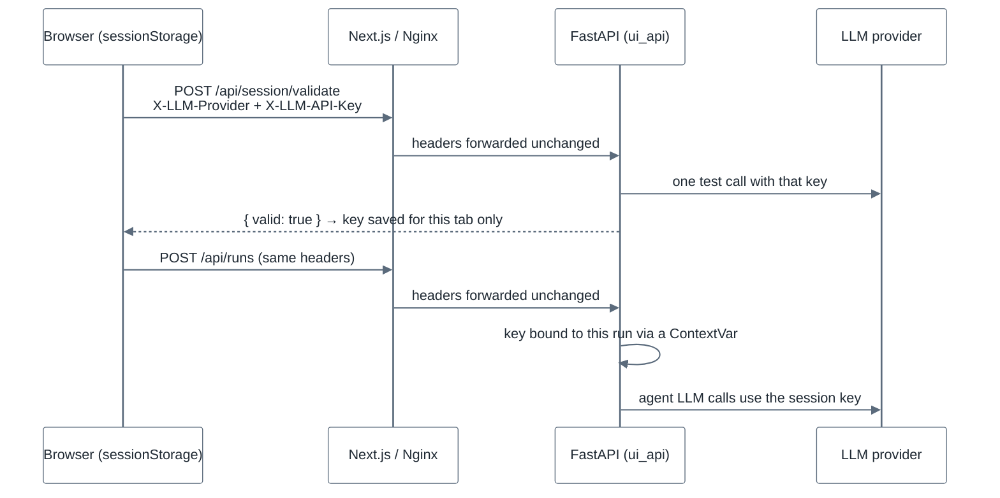
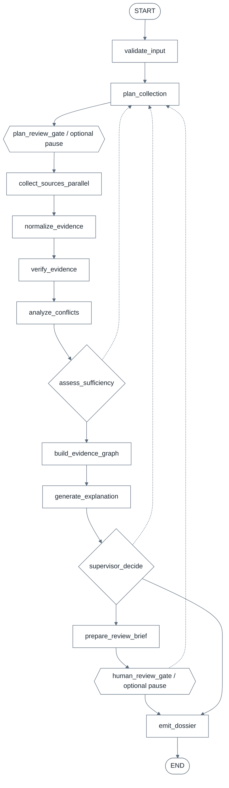

# 💊 Drug Discovery Agent

<div align="center">

**Multi-agent AI system that collects, verifies, and explains drug-target evidence for a gene**
Built on **LangGraph · MCP · FastAPI · Next.js · OpenAI / Google Gemini**
Data from **DepMap · PHAROS · Open Targets · Europe PMC**

[](https://python.org)
[](https://github.com/langchain-ai/langgraph)
[](https://fastapi.tiangolo.com)
[](https://nextjs.org)
[](https://docs.docker.com/compose/)

</div>

---

## Table of Contents

- [What it does](#what-it-does)
- [Bring your own API key (no server key needed)](#bring-your-own-api-key-no-server-key-needed)
- [How it works](#how-it-works)
- [Agents](#agents)
- [Data sources (MCP layer)](#data-sources-mcp-layer)
- [Scoring and conflict detection](#scoring-and-conflict-detection)
- [Memory and artifacts](#memory-and-artifacts)
- [Quick start (local)](#quick-start-local)
- [Deployment](#deployment)
- [REST API](#rest-api)
- [CLI](#cli)
- [Configuration](#configuration)
- [Project structure](#project-structure)
- [Testing](#testing)
- [Example reports](#example-reports)
- [Technology stack](#technology-stack)
- [Further documentation](#further-documentation)
- [Contributing](#contributing)

---

## What it does

Assessing a gene as a drug target usually means querying several biomedical databases by hand, reconciling
identifiers, weighing heterogeneous evidence, and writing it up. This project automates that loop for one
gene (optionally in a disease context):

1. **Plans** which sources to query and how (LLM planner with a deterministic fallback).
2. **Collects** evidence from DepMap, PHAROS, Open Targets, and Europe PMC through MCP servers.
3. **Normalizes and verifies** every record (schema, provenance, stable evidence IDs, gene mapping).
4. **Scores** evidence per category, **detects cross-source conflicts**, and checks whether there is enough
   evidence — automatically re-collecting with a wider search if not.
5. **Explains** the result in a cited, 9-section scientific report and emits a structured `EvidenceDossier`.
6. Optionally **pauses for a human** to approve the plan or review the final evidence.

Every run is traceable: evidence records carry provenance, and each stage writes JSON artifacts you can inspect.

---

## Bring your own API key (no server key needed)

You can deploy and use the web UI **without putting any API key on the server**. When no server key is
configured, the UI asks each visitor for their own **OpenAI** or **Google Gemini** key
(Gemini has a free tier: [aistudio.google.com/apikey](https://aistudio.google.com/apikey)).



How the key is handled:

- **Browser:** stored in `sessionStorage` (`drugagent.llm_key.v1`), so it disappears when the tab is closed.
  It is only sent after `POST /api/session/validate` confirms it works.
- **Transport:** sent as `X-LLM-Provider: openai|google` and `X-LLM-API-Key` headers on the requests that can
  call an LLM: `POST /api/runs`, `/api/runs/from-text`, `/api/runs/{id}/resume`, `/api/runs/{id}/followup`.
- **Server:** the key is bound to that request/run with a `ContextVar`
  ([`agents/llm_credentials.py`](agents/llm_credentials.py)). It is never written to `os.environ`, never
  stored in the run request, dossier, or artifacts, and never shared with other users' runs. Each key gets its
  own rate-limit bucket, and error messages are redacted before being returned.
- **Precedence:** a session key replaces the server keys for that user's runs. If the server has a working key,
  the key dialog is optional.
- Without a session key **and** without a working server key, run creation returns `401` with a clear message.

> **Use HTTPS for any public deployment.** Visitors' keys travel in request headers, so plain HTTP would
> expose them. See [Deployment → HTTPS](#https-required-for-public-deployments).

The CLI does not prompt for a key; it reads `OPENAI_API_KEY` / `GOOGLE_API_KEY` from `.env`.

---

## How it works

The pipeline is a LangGraph `StateGraph` in [`agents/graph.py`](agents/graph.py). Every node reads and writes a
shared `CollectorState` ([`agents/state.py`](agents/state.py)); state is checkpointed per run (`thread_id = run_id`)
and also snapshotted to disk so paused runs can be resumed after a restart.



Solid arrows are the main path; dotted arrows are the three loops back to planning:

| Loop back to `plan_collection` | When |
|---|---|
| from `assess_sufficiency` | evidence is insufficient → retry with a wider search |
| from `supervisor_decide` | the supervisor asks to re-collect |
| from `human_review_gate` | a reviewer answers `needs_more_evidence` |

`collect_sources_parallel` queries DepMap, PHAROS, Open Targets and Europe PMC through MCP servers.

- **Auto re-collect:** when evidence is insufficient (and there's no blocking error or high-severity conflict),
  the graph loops back to planning with larger `top_k` / literature limits
  (`A4T_AUTO_RECOLLECT_MAX_PASSES`, default 1; values capped at 20).
- **Human-in-the-loop gates** use LangGraph `interrupt()`. A paused run is resumed after a decision is posted:
  - Plan gate: `A4T_REQUIRE_PLAN_APPROVAL=1` → decision `approved | rejected | needs_changes`
  - Review gate: `A4T_REQUIRE_REVIEW=1` → decision `approved | rejected | needs_more_evidence`
  - The **web UI turns both gates off by default**; the CLI keeps the review gate **on** by default.

---

## Agents

All agents live in [`agents/`](agents/). LLM-backed agents have a deterministic fallback unless strict mode
(`A4T_REQUIRE_LLM_AGENTS=1`) is on.

| Component | File | Role | LLM? |
|---|---|---|---|
| **InputValidationAgent** | `input_validation_agent.py` | Validates the request and looks up past runs in episodic memory | No |
| **PlanningAgent** | `planning_agent.py`, `planner.py` | Source order, query variants, per-source directives; cached plans | Yes (fallback plan) |
| **Source collectors** | `mcp_runtime.py`, [`mcps/`](mcps/) | Dispatch MCP tool calls per source | No |
| **NormalizationAgent** | `normalization_agent.py`, `normalizer.py` | Clamp scores/confidence, canonical symbols, stable evidence IDs | No |
| **Verifier** | `verifier.py` | 10 verification rules (6 blocking: presence, source success, schema, provenance, evidence ID, gene mapping) | No |
| **Conflict analysis** | `conflicts.py` | Flags cross-source disagreement | No |
| **Evidence sufficiency** | `evidence_sufficiency.py` | Decides pass vs. auto re-collect | No |
| **Evidence graph** | `evidence_graph.py` | Provenance-linked graph snapshot | No |
| **SummaryAgent** | `summary_agent.py`, `summary_validation.py` | Writes the report; validator enforces sections and evidence-ID citations | Yes (`compiler`/`dossier` formats) |
| **SupervisorAgent** | `supervisor_agent.py` | Chooses: re-collect, request human review, or emit dossier | Yes (rule-based fallback) |
| **ReviewSupportAgent** | `review_support_agent.py` | Prepares the brief shown to a human reviewer | Yes (fallback) |
| **FollowupAgent** | `followup_agent.py` | Answers follow-up questions about a finished run (optionally with URLs) | Yes |
| **QueryInterpretationAgent** | `query_interpretation_agent.py` | Turns free text into gene / disease / objective | Heuristics first, LLM if ambiguous |

### LLM routing

Implemented in [`agents/llm_policy.py`](agents/llm_policy.py) and [`agents/provider_select.py`](agents/provider_select.py):

```
session key (if any) ─► pins the provider for that run
        │
primary model ──► same-provider fallback models ──► other provider (cross-provider fallback)
        │                                                   │
        └──────────── all failed ──► deterministic fallback (only if A4T_REQUIRE_LLM_AGENTS=0)
```

- Providers: **OpenAI** (`ChatOpenAI`) and **Google Gemini** (`ChatGoogleGenerativeAI`).
- At API startup the server probes available keys and picks one provider (`A4T_SYSTEM_LLM_PROVIDER=auto` tries OpenAI first).
- Built-in retry with backoff, 429 handling, a concurrency semaphore, and request spacing — all tunable via env vars.

---

## Data sources (MCP layer)

Each source is a FastMCP server over **stdio** in [`mcps/`](mcps/); the orchestrator launches
`python -m mcps.<source>_mcp` as a subprocess. Connector logic lives in [`mcps/connectors/`](mcps/connectors/).

| Source | Connector | Protocol | Evidence produced |
|---|---|---|---|
| **DepMap** | `depmap.py` | Local CSV (`CRISPRGeneEffect.csv`, Chronos) | Mean gene effect, strong-dependency fraction (≤ −0.5), most dependent cell lines |
| **PHAROS** | `pharos.py` | GraphQL (`pharos-api.ncats.io`) | Target Development Level (Tclin/Tchem/Tbio/Tdark), family, novelty, ligand counts |
| **Open Targets** | `opentargets.py` | GraphQL (Platform API v4) | Gene–disease association scores |
| **Europe PMC** | `literature.py` | REST search | Highly cited articles mentioning the gene |

- **DepMap data** is downloaded once (~300 MB) by `python scripts/download_depmap.py` into
  `mcps/connectors/.depmap_cache/` (override with `DEPMAP_CACHE_DIR`). If the file is missing, DepMap is marked
  *skipped* and the run continues with the other sources. The Docker image downloads it at build time.
- Failed sources degrade gracefully: they are recorded in `source_status` / `errors` instead of crashing the run.
- **External MCP options** (`ext_opentargets`, `ext_pharos` source names) wrap the official Open Targets MCP and a
  community PHAROS MCP. They need extra local setup — see [`external_mcps/LOCAL_SETUP.md`](external_mcps/LOCAL_SETUP.md).

---

## Scoring and conflict detection

Implemented in [`agents/scoring.py`](agents/scoring.py) and [`agents/conflicts.py`](agents/conflicts.py).

**Per-record quality:** `0.6 × score + 0.4 × confidence` (both in [0, 1]).
**Per-category score:** mean quality of the top 3 records in that category.

| Category | Weight | Main source |
|---|---|---|
| Genetic dependency | 0.30 | DepMap |
| Disease association | 0.30 | Open Targets |
| Target annotation | 0.25 | PHAROS |
| Literature | 0.15 | Europe PMC |

```
overall_support_score = clamp01( Σ weight × category_score  −  max conflict penalty )
conflict penalty: high 0.10 · medium 0.05 · low 0.02
completeness      = share of the 4 categories that have any evidence
```

**Decision labels**

| Label | Condition |
|---|---|
| Strongly Supported | score ≥ 0.75 and completeness ≥ 0.75 |
| Supported with Context Limits | score ≥ 0.60 and completeness ≥ 0.50 |
| Mixed / Context-Dependent | score ≥ 0.45 |
| Weakly Supported | score ≥ 0.25 |
| Not Supported | otherwise |

A high-severity conflict downgrades the top two labels by one step.

**Source-level normalization** (in the connectors):

- DepMap Chronos gene effect → `clamp01((1.5 − gene_effect) / 3.0)`
- PHAROS TDL → Tclin 0.95 · Tchem 0.75 · Tbio 0.55 · Tdark 0.25 (+ up to 0.2 for ligand count)
- Open Targets → raw association score

**Conflicts** are checked within groups of the same target, disease, and evidence type reported by ≥ 2 sources:

| Severity | Condition |
|---|---|
| HIGH | min score ≤ 0.25 **and** max score ≥ 0.75 |
| MEDIUM | spread ≥ 0.35 |
| LOW | spread ≥ 0.20 |

---

## Memory and artifacts

Everything is written under `A4T_ARTIFACT_DIR` (default `./artifacts`, `/data/artifacts` in Docker).

| Memory layer | Location | Purpose |
|---|---|---|
| Episodic | `episodic_memory/runs.json` | Past runs; read by input validation and planning |
| Working | `working_memory/<run_id>/<stage>.json` | Per-stage snapshots for debugging |
| Run state | `working_memory/<run_id>/latest.json` | Lets the UI/API reload and resume runs after a restart |
| Semantic | `semantic_memory/knowledge.json` | Gene aliases used by the planner and verifier |
| Procedural | `procedural_memory/<run_id>.procedural_memory.json` | Versions, prompt hash, node sequence (reproducibility) |
| Content | `docs/CONTENT_MEMORY.md` (or `A4T_CONTENT_MEMORY_PATH`) | Project context injected into LLM prompts |

Other per-run artifacts:

```
artifacts/
├── plans/{run_id}.collection_plan.json
├── dossiers/{run_id}.evidence_dossier.json      ← final structured output
├── graphs/{run_id}.evidence_graph.json
├── metrics/{run_id}.metrics.json
├── health_reports/{run_id}.health.json
├── plan_decisions/{run_id}.plan_decision.json
├── plan_audit/{run_id}/…
├── review_decisions/{run_id}.review_decision.json
└── review_audit/{run_id}/…
```

Set `A4T_PROMPT_TRACE_ENABLED=1` to also save every system/user prompt under `prompts/{run_id}/`.
See [`docs/ARTIFACT_STORAGE_POLICY.md`](docs/ARTIFACT_STORAGE_POLICY.md) for retention.

---

## Quick start (local)

**Prerequisites:** Python 3.11+, Node.js 20+, ~1 GB free disk (DepMap CSV + dependencies).

```bash
git clone https://github.com/himanshu1573/Drug-disovery-multiple-agent.git
cd Drug-disovery-multiple-agent

python3 -m venv venv && source venv/bin/activate
pip install -r requirements.txt

# Optional but recommended: DepMap CRISPR data (~300 MB). Without it, DepMap is skipped.
python scripts/download_depmap.py
```

### Web UI (no key required)

```bash
# Terminal 1 — API on :8000
uvicorn ui_api.app:app --reload --port 8000

# Terminal 2 — UI on :3000
cd frontend
npm install
npm run dev
```

Open <http://localhost:3000>. If you have no server key, the UI will ask for your OpenAI or Gemini key.
To use a server key instead, `cp .env.example .env` and fill in `OPENAI_API_KEY` or `GOOGLE_API_KEY`.

In the UI you can enter a gene (e.g. `EGFR`) or a free-text question, choose sources, watch progress live
(Server-Sent Events), read the report, and ask follow-up questions about the run.

### CLI (needs a key in `.env`)

```bash
cp .env.example .env        # set OPENAI_API_KEY or GOOGLE_API_KEY

# Run straight through (skip the human review pause) and save a markdown report to results/
A4T_REQUIRE_REVIEW=0 python -m cli run --gene EGFR --disease "non-small cell lung cancer" --save-markdown
```

---

## Deployment

The app ships as three Docker services behind one domain:

| Service | Image | Role |
|---|---|---|
| `nginx` | `nginx:1.27-alpine` | Public entry (port 80). `/` → web, `/api/` → api, SSE tuned for `/api/runs/*/events` |
| `web` | `Dockerfile.web` (Node 20) | Next.js UI on :3000 |
| `api` | `Dockerfile.api` (Python 3.11) | FastAPI + agents + MCP servers on :8000; downloads DepMap at build time |

Run artifacts persist in the `artifacts-data` Docker volume.

### Option A — any machine with Docker (try it locally)

```bash
make deploy-up                      # copies deploy/.env.example → deploy/.env if missing, then builds and starts
# port 80 busy?  cd deploy && A4T_HTTP_PORT=8080 docker compose up -d --build
```

Open <http://localhost> (or <http://localhost:8080>). With the keys in `deploy/.env` left blank, every visitor is
asked for their own key — nothing secret is needed on the server.

### Option B — a small VPS (recommended for sharing)

Any VPS with a public IP works (DigitalOcean, Hetzner, AWS Lightsail, Linode, …).

```bash
# on the server (Ubuntu), one time
curl -fsSL https://get.docker.com | sudo sh
sudo usermod -aG docker $USER && newgrp docker

git clone https://github.com/himanshu1573/Drug-disovery-multiple-agent.git
cd Drug-disovery-multiple-agent/deploy
cp .env.example .env               # leave OPENAI_API_KEY empty for bring-your-own-key mode
docker compose up -d --build
```

Open `http://<server-ip>/`. Useful commands:

```bash
docker compose ps
docker compose logs -f api         # or web / nginx
docker compose down                # stop (artifacts volume is kept)
git pull && docker compose up -d --build   # update
```

### HTTPS (required for public deployments)

The bundled Nginx config is HTTP-only. Because visitors' API keys are sent in request headers, put TLS in front
before sharing the URL:

1. **Cloudflare** proxy in front of the server (easiest), or
2. **Caddy** as a TLS terminator in front of Nginx, or
3. **Certbot** + an Nginx TLS server block.

Step-by-step beginner instructions: [`DEPLOYMENT.md`](DEPLOYMENT.md) · environment matrix:
[`docs/DEPLOYMENT_ENVIRONMENT_MATRIX.md`](docs/DEPLOYMENT_ENVIRONMENT_MATRIX.md).

> **Platform hosts** (Render, Railway, Fly.io) can run the Docker images, but you'll need to split the API and
> UI into separate services and point the UI's `API_PROXY_TARGET` at the API. A single VPS is the simplest path.

---

## REST API

FastAPI app: [`ui_api/app.py`](ui_api/app.py) — `uvicorn ui_api.app:app --port 8000`. Interactive docs at
`/docs` when running locally.

| Method | Path | Description |
|---|---|---|
| `GET` | `/api/health` | Status, selected LLM provider, key flags |
| `POST` | `/api/session/validate` | Validate a bring-your-own key (headers `X-LLM-Provider`, `X-LLM-API-Key`) |
| `POST` | `/api/runs` | Start a run from structured input |
| `POST` | `/api/runs/from-text` | Start a run from a free-text question |
| `GET` | `/api/runs/{run_id}/state` | Current run state |
| `GET` | `/api/runs/{run_id}/events` | Server-Sent Events progress stream |
| `GET` | `/api/runs/{run_id}/artifacts` | Artifact paths for the run |
| `POST` | `/api/runs/{run_id}/plan-decision` | Submit plan decision (`approved`/`rejected`/`needs_changes`) |
| `POST` | `/api/runs/{run_id}/review-decision` | Submit review decision (`approved`/`rejected`/`needs_more_evidence`) |
| `POST` | `/api/runs/{run_id}/resume` | Resume a paused run |
| `POST` | `/api/runs/{run_id}/followup` | Ask a follow-up question about a finished run |

Example:

```bash
curl -X POST http://localhost:8000/api/runs \
  -H "Content-Type: application/json" \
  -H "X-LLM-Provider: google" \
  -H "X-LLM-API-Key: $GEMINI_KEY" \
  -d '{
        "gene_symbol": "KRAS",
        "objective": "Assess KRAS as a target in pancreatic cancer",
        "sources": ["depmap", "pharos", "opentargets", "literature"],
        "per_source_top_k": 10,
        "max_literature_articles": 5
      }'
# → {"run_id": "run-3f9c2b1a7d4e", "status": "started"}

curl -N http://localhost:8000/api/runs/run-3f9c2b1a7d4e/events   # live progress
```

Omit the two `X-LLM-*` headers if the server has its own key.

---

## CLI

```
python -m cli run      --gene EGFR [options]      Run a collection
python -m cli review   --run-id ID --decision approved|rejected|needs_more_evidence \
                       --reviewer-id NAME --reason TEXT
python -m cli resume   --run-id ID                Continue a paused run
python -m cli repl                                Interactive prompt
```

`run` options:

| Flag | Default | Description |
|---|---|---|
| `--gene, -g` | *(required)* | Gene symbol |
| `--disease, -d` | – | Disease context |
| `--sources, -s` | `opentargets,pharos,literature,depmap` | Comma-separated sources |
| `--output, -o` | `table` | `table` · `json` · `minimal` |
| `--save FILE` | – | Save the result JSON |
| `--save-markdown` | off | Write `results/<GENE>_summary.md` |
| `--top-k` | 15 | Records per source (also used for literature) |
| `--model` | – | Override the summary model |
| `--objective` | – | Research objective |
| `--run-id` | auto | Custom run ID |

With the default review gate on, `run` pauses before the dossier is emitted and exits with code `2`. Approve with
`python -m cli review …`, then `python -m cli resume --run-id …` — or set `A4T_REQUIRE_REVIEW=0` to skip the pause.
Set `A4T_REPORT_FORMAT=compiler` for the full LLM-written 9-section report (the CLI default is `structured`).

---

## Configuration

All settings are environment variables (the API and CLI load `.env` from the repo root; Docker uses `deploy/.env`).
Full reference: [`docs/CONFIGURATION_POLICY.md`](docs/CONFIGURATION_POLICY.md).

| Variable | Default | Description |
|---|---|---|
| `OPENAI_API_KEY` / `GOOGLE_API_KEY` (`GEMINI_API_KEY`) | empty | Optional server keys. Leave empty for bring-your-own-key mode (web UI) |
| `A4T_SYSTEM_LLM_PROVIDER` | `auto` | `auto` · `openai` · `google` |
| `A4T_OPENAI_REASONING_MODEL` / `A4T_OPENAI_FAST_MODEL` | – | Override OpenAI models |
| `A4T_GOOGLE_REASONING_MODEL` / `A4T_GOOGLE_FAST_MODEL` | `gemini-2.5-flash` | Override Gemini models |
| `A4T_REPORT_FORMAT` | `compiler` (UI) · `structured` (CLI) | LLM-written report vs. deterministic summary |
| `A4T_REQUIRE_PLAN_APPROVAL` | `0` | Pause for plan approval |
| `A4T_REQUIRE_REVIEW` | `0` (UI) · `1` (CLI) | Pause for human review before emitting the dossier |
| `A4T_REQUIRE_LLM_AGENTS` | `1` | Strict mode: fail instead of silently using deterministic fallbacks |
| `A4T_LLM_CALLS_ENABLED` | `1` | Master switch for LLM calls |
| `A4T_LLM_CROSS_PROVIDER_FALLBACK` | `1` | Fall back to the other provider when its key exists |
| `A4T_LLM_TIMEOUT_S` | `180` (UI) | Per-call timeout |
| `A4T_LLM_CONCURRENCY` / `A4T_LLM_RPM` / `A4T_LLM_MIN_INTERVAL_S` | `1` / `10` / `3.0` (UI) | Rate limiting (tuned for Gemini free tier) |
| `A4T_SOURCE_DISPATCH_MODE` | `sequential` | `sequential` · `parallel` source collection |
| `A4T_AUTO_RECOLLECT_MAX_PASSES` | `1` | Auto re-collect passes when evidence is insufficient |
| `A4T_ARTIFACT_DIR` | `./artifacts` | Artifact root |
| `A4T_UI_CORS_ORIGINS` | `http://localhost:3000` | Allowed browser origins for the API |
| `DEPMAP_CACHE_DIR` | `mcps/connectors/.depmap_cache` | DepMap CSV location |
| `NEXT_PUBLIC_API_BASE_URL` (frontend) | `http://localhost:8000/api` (dev) · `/api` (prod) | Where the browser sends API calls |
| `API_PROXY_TARGET` (frontend) | `http://localhost:8000/api` | Upstream for the Next.js `/api` proxy route |

---

## Project structure

```
Drug-disovery-multiple-agent/
├── agents/                 ← pipeline (graph.py), state, agents, scoring, memory, LLM policy, BYOK credentials
├── mcps/                   ← FastMCP servers per source (stdio)
│   └── connectors/         ← DepMap / PHAROS / Open Targets / Europe PMC clients
├── ui_api/                 ← FastAPI gateway (app.py), request models, SSE event bus
├── cli/                    ← `python -m cli` entry point
├── frontend/               ← Next.js 15 + React 19 UI
│   └── src/
│       ├── app/            ← page.tsx (workbench), api/[...path] proxy route
│       ├── components/     ← ApiKeyDialog, PlanApprovalPanel, ReviewDecisionPanel, MarkdownReport, …
│       ├── hooks/          ← useRunEvents (SSE)
│       └── lib/            ← api.ts client, llmKey.ts (session key storage)
├── tests/                  ← pytest suite (+ fixtures)
├── scripts/                ← DepMap download, CI gates, smoke tests, audits
├── deploy/                 ← production Docker Compose + Nginx config (recommended)
├── docs/                   ← architecture, policies, runbooks, UAT packs
├── external_mcps/          ← optional external Open Targets / PHAROS MCP setup
├── results/                ← example reports
├── Dockerfile.api · Dockerfile.web · docker-compose.yml
├── Makefile · requirements.txt · pytest.ini · mypy.ini
└── DEPLOYMENT.md
```

---

## Testing

```bash
python -m pytest -q                       # full suite; live-network tests are skipped unless RUN_NETWORK_TESTS=1
python -m pytest tests/test_llm_credentials.py tests/test_ui_session_keys_api.py -q   # BYOK tests
make quality                              # ruff + mypy + coverage gate (what CI runs)

cd frontend && npx tsc --noEmit && npm run lint                 # frontend type-check + lint
```

Under pytest (`PYTEST_CURRENT_TEST` is set), live LLM calls, strict LLM mode, and the planner cache are
disabled by default, so the suite runs offline without API keys.

---

## Example reports

Reports generated with the CLI (`--save-markdown`), each a 9-section "Therapeutic Target Evidence Summary":

[BRAF](results/BRAF_summary.md) · [BRCA1](results/BRCA1_summary.md) · [EGFR](results/EGFR_summary.md) ·
[KRAS](results/KRAS_summary.md) · [MYC](results/MYC_summary.md) · [TP53](results/TP53_summary.md)

---

## Technology stack

| Area | Technology |
|---|---|
| Orchestration | LangGraph ≥ 0.2, LangChain ≥ 0.3 |
| Tool protocol | MCP (Model Context Protocol) ≥ 1.0, < 2 — FastMCP servers over stdio |
| LLMs | OpenAI (`langchain-openai`), Google Gemini (`langchain-google-genai`) |
| Backend | Python 3.11+, FastAPI ≥ 0.115, Uvicorn, Pydantic v2, httpx, pandas |
| Frontend | Next.js 15, React 19, TypeScript, Tailwind CSS, react-markdown |
| Infra | Docker, Docker Compose, Nginx |
| Quality | pytest + pytest-asyncio, coverage, Ruff, mypy, GitHub Actions |

---

## Further documentation

| Document | Topic |
|---|---|
| [`docs/ARCHITECTURE.md`](docs/ARCHITECTURE.md) | System architecture |
| [`docs/COMPLETE_FLOW_AND_RESPONSIBILITIES.md`](docs/COMPLETE_FLOW_AND_RESPONSIBILITIES.md) | Node-by-node flow |
| [`docs/UI_GATEWAY.md`](docs/UI_GATEWAY.md) | API gateway and UI integration |
| [`docs/MCP_SERVERS.md`](docs/MCP_SERVERS.md) | MCP servers |
| [`docs/CONFIGURATION_POLICY.md`](docs/CONFIGURATION_POLICY.md) | All configuration knobs |
| [`docs/HUMAN_REVIEW_INTERFACE_CONTRACT.md`](docs/HUMAN_REVIEW_INTERFACE_CONTRACT.md) | Review gate contract |
| [`docs/OPERATIONAL_RUNBOOK.md`](docs/OPERATIONAL_RUNBOOK.md) | Operations |
| [`docs/add_new_collector.md`](docs/add_new_collector.md) | Adding a new data source |
| [`DEPLOYMENT.md`](DEPLOYMENT.md) | Beginner deployment guide |

---

## Contributing

1. Fork the repository and create a branch: `git checkout -b feature/your-feature`
2. Make your change with tests
3. Run `python -m pytest -q` and `make quality`
4. Open a pull request (template in [`.github/pull_request_template.md`](.github/pull_request_template.md))

To add a data source, follow [`docs/add_new_collector.md`](docs/add_new_collector.md).
